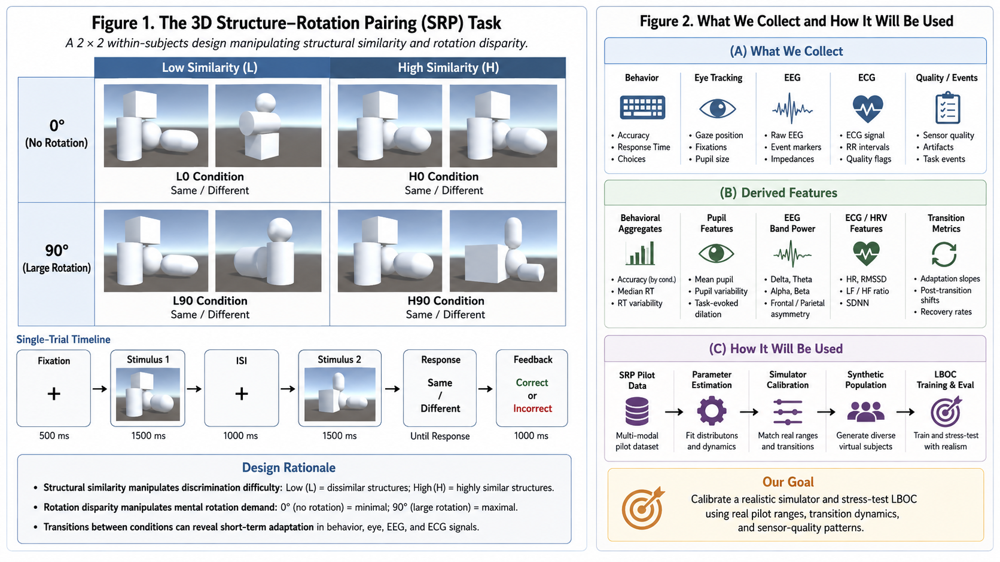

# 3D Structure–Rotation Pairing (SRP) Task

A compact XR experiment for collecting **behavioral, physiological, and sensor-quality responses** under controlled changes in **3D structural similarity** and **rotation disparity**.

The SRP task is designed as an **empirical anchoring study** for the LBOC project. Its purpose is not to establish population-level psychophysiological effects from a small sample, but to provide realistic ranges, temporal dynamics, inter-participant variability, and sensor-failure statistics that can constrain a large-scale synthetic human simulator.



---

## 1. Why this experiment exists

LBOC requires training data that go beyond static multimodal state estimation. In particular, the later action-outcome stages need trajectories of the form:

```text
user state / recent history
        +
current XR context
        +
known action
        ↓
post-action human response
```

Collecting enough real human intervention data to densely cover users, task states, actions, sensor degradation patterns, and temporal responses is expensive. The SRP pilot therefore serves a narrower and more practical role:

> **Measure what responses look like in the real task, then use those measurements to calibrate the parameter space of a synthetic simulator that can generate much larger State–Observation–Action–Outcome datasets.**

The real participants are therefore **anchors**, not templates that are simply copied with noise.

---

## 2. Task paradigm

Participants view two 3D objects sequentially and judge whether the second object is the **same as** or **different from** the immediately preceding object.

The task manipulates two factors:

- **Structural Similarity**: Low / High
- **Rotation Disparity**: 0° / 180°

This yields the main 2 × 2 challenge space:

| Condition | Rotation 0° | Rotation 180° |
|---|---:|---:|
| **Low Structural Similarity** | L0 | L180 |
| **High Structural Similarity** | H0 | H180 |

### Structural similarity

Each object is composed of four geometric parts. Similarity is defined from the preservation of structural relations between parts rather than from raw image similarity.

The 2 × 2 design intentionally keeps only two levels of each factor so that:

- the task remains interpretable;
- the action space stays small;
- condition transitions are easy to control;
- pilot data can be collected quickly;
- later simulator and LBOC experiments have a clean minimum-scale environment.

### Same trials

The 2 × 2 matrix describes the main **Different-object challenge conditions**. Same trials are interleaved so that participants cannot solve the task by always responding “Different”.

---

## 3. Pilot design

The current pilot is intended for approximately **4–5 participants**.

Each participant completes all four conditions, with at least:

- **40 Different trials per condition**
- interleaved Same trials
- deliberately arranged condition transitions

Example transition sequence:

```text
H90 → L90 → H0 → L0 → H90
```

The transition structure is important because the pilot is not only interested in condition averages. It also aims to measure **how quickly behavioral and physiological signals adapt after the task context changes**.

---

## 4. What we want to collect

The experiment records raw or minimally processed measurements. Derived features are computed later.

### 4.1 Behavioral data

For every trial:

| Field | Description |
|---|---|
| `participant_id` | Anonymous participant identifier |
| `trial_id` | Trial index |
| `similarity_level` | Low / High |
| `rotation_deg` | 0 / 180 |
| `pair_label` | Same / Different ground truth |
| `response` | Participant response |
| `correct` | Accuracy |
| `reaction_time_ms` | Response latency |
| `previous_condition` | Condition before the current trial/block |
| `condition_changed` | Whether a transition just occurred |
| `trials_since_transition` | Number of trials since the latest transition |
| `timestamp` | Synchronization timestamp |

Behavioral performance is the most direct observable response and provides a reference for estimating task sensitivity, transition effects, and between-user variability.

---

### 4.2 Eye tracking

Where supported by the HMD, record:

- gaze origin and direction;
- pupil diameter;
- fixation/saccade-related samples if available;
- blink or invalid-sample markers;
- eye-tracking confidence / validity;
- timestamps.

Possible derived features include:

- mean and change in pupil size;
- gaze dispersion;
- fixation duration;
- saccade-related statistics;
- invalid-sample ratio;
- post-transition stabilization time.

The goal is **not** to assume that eye tracking corresponds to one specific action dimension. The pilot instead provides realistic magnitude, variability, and temporal-response ranges.

---

### 4.3 EEG

Record the available raw EEG channels together with:

- timestamps;
- channel metadata;
- signal-quality indicators where available;
- dropped/invalid samples;
- artefact markers where available.

Possible derived features include:

- band power;
- relative band power;
- simple temporal/statistical features;
- signal-quality measures;
- invalid-window / artefact rate.

The pilot does **not** treat any EEG feature as a guaranteed ground-truth marker of structural similarity, rotation, workload, or another latent state.

---

### 4.4 ECG

Record raw ECG together with:

- timestamps;
- channel information;
- signal-quality indicators;
- missing/corrupted segments.

Possible derived features include:

- heart rate;
- RR intervals;
- selected HRV features;
- signal-quality statistics;
- corrupted-window ratio.

The primary purpose is to estimate realistic ranges, noise levels, temporal response, and participant variability in this task.

---

### 4.5 HMD / head motion

If already available in the acquisition pipeline, record:

- head position;
- head orientation;
- angular velocity;
- linear velocity;
- motion magnitude.

These signals can provide additional behavioral evidence and help characterize motion-related artefacts.

They are useful but are not required to define the core SRP paradigm.

---

### 4.6 Sensor quality and failure information

Sensor degradation is a central part of the later LBOC evaluation, so quality information should be preserved rather than discarded during preprocessing.

Examples include:

- eye-tracking loss;
- EEG artefacts;
- ECG corrupted windows;
- dropped samples;
- temporary modality unavailability;
- timing delay;
- synchronization error;
- motion-related corruption.

The pilot should therefore retain both **usable measurements** and **evidence of when measurements were unreliable**.

---

## 5. What we want to estimate from the pilot

The pilot is used to estimate **ranges and distributions**, not definitive population effects.

### Behavioral calibration

Estimate:

- Accuracy range in each condition
- RT range in each condition
- between-participant variability
- within-participant variability
- magnitude of condition changes
- response after condition transitions

### Physiological calibration

For Eye, EEG, and ECG, estimate:

- typical feature ranges
- within-user variability
- between-user variability
- approximate effect magnitudes where observable
- temporal lag after context changes
- stabilization / recovery time

### Sensor calibration

Estimate:

- missing-data rates
- artefact rates
- tracking-loss rates
- noisy-window frequency
- typical quality distributions

### Transition dynamics

A particularly important output is the approximate time scale of adaptation after a context switch:

```text
old condition
    ↓
condition change
    ↓
transient response
    ↓
new stable range
```

This information will be used to constrain response delay and state-transition parameters in the simulator.

---

## 6. What happens after the pilot

The pilot data are not intended to train the final LBOC model directly.

The intended pipeline is:

```text
SRP pilot
    ↓
estimate realistic ranges,
variability, delays, and sensor quality
    ↓
calibrate virtual-human simulator
    ↓
generate a large virtual population
    ↓
generate State–Observation–Action–Outcome trajectories
    ↓
train and evaluate LBOC
```

Each synthetic user can vary in parameters such as:

- sensitivity to structural similarity;
- sensitivity to rotation;
- response gain;
- response delay;
- recovery dynamics;
- modality-specific loading;
- sensor noise;
- sensor bias;
- dropout probability.

The simulator is therefore expected to generate **new combinations of plausible user traits**, rather than simply producing noisy copies of the 4–5 pilot participants.

---

## 7. Relation to LBOC

The SRP task supplies a small but controlled world with two independently adjustable challenge dimensions.

This makes it possible to define candidate XR actions such as:

```text
No-op
Reduce Similarity
Reduce Rotation
Increase task challenge
```

LBOC can then be tested on the question:

> Given incomplete and possibly degraded multimodal evidence, how uncertain is the predicted outcome of **each candidate action**, and how should that uncertainty constrain the executable action range?

The SRP task is therefore an **experimental substrate** for LBOC rather than the primary research contribution by itself.

---

## 8. What this pilot does *not* claim

With 4–5 participants, this study does not attempt to establish that:

- the observed effects generalize to the human population;
- EEG uniquely represents rotation demand;
- eye tracking uniquely represents structural or rotational demand;
- any physiological feature is a direct ground truth for cognitive workload;
- the synthetic population represents the true human population distribution;
- LBOC has already been validated for real-world human closed-loop control.

If a modality shows no reliable task-related difference in the pilot, its simulator loading should **not** be force-fitted from the small sample. Instead, the simulator should retain a broader prior range and clearly document the source of that assumption.

---

## 9. Primary output of the SRP pilot

The main deliverable is a compact empirical calibration package containing:

```text
Condition-level behavioral ranges
Participant-level variability
Physiological feature ranges
Transition-response time scales
Sensor noise / dropout statistics
Synchronization and data-quality information
```

These outputs will be used to constrain the next-stage synthetic simulator.

---

## 10. One-sentence summary

> **The SRP task collects real behavioral, physiological, temporal, and sensor-quality responses from a small controlled 2 × 2 Structure × Rotation experiment so that a large synthetic human-response simulator can be calibrated to realistic scales before training and stress-testing LBOC.**
